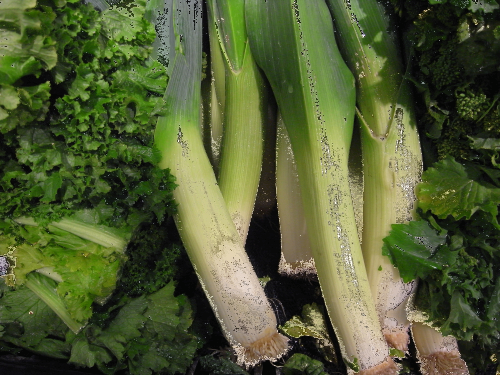
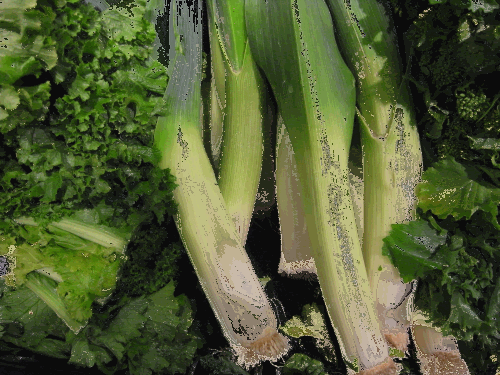
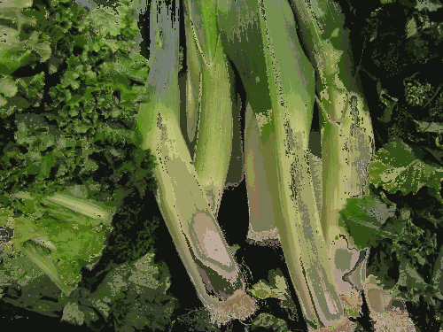

# Color Quantization

## Octree

⚠️ This code I made has some issues. Some colors are too difference from the
original image.

| depth 5                                | depth 4                                | depth 3                                | depth 2                                |
| -------------------------------------- | -------------------------------------- | -------------------------------------- | -------------------------------------- |
|  |  |  |  |

## References

https://en.wikipedia.org/wiki/Octree  
https://observablehq.com/@tmcw/octree-color-quantization  
https://github.com/DanBloomberg/leptonica/blob/master/src/colorquant1.c
